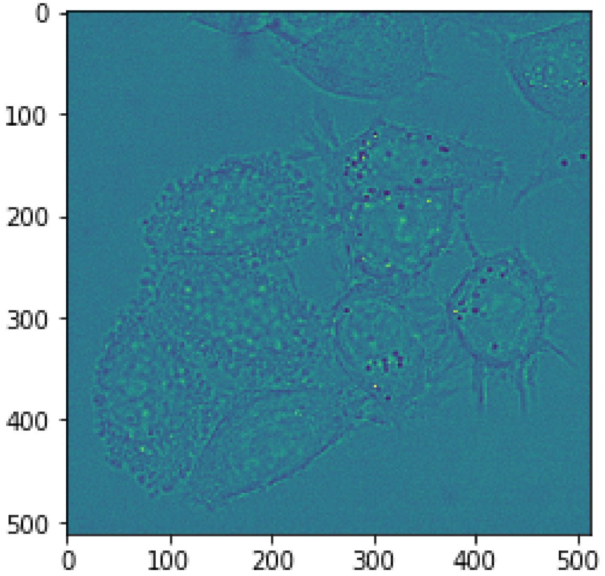
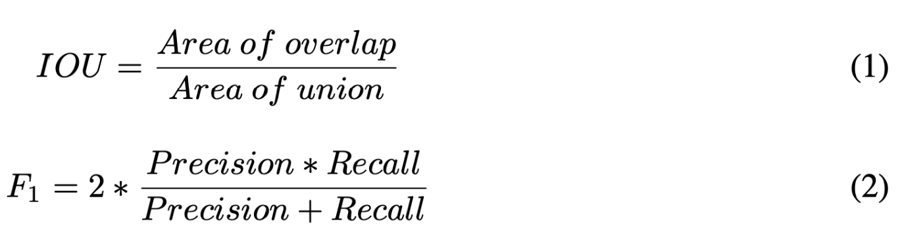
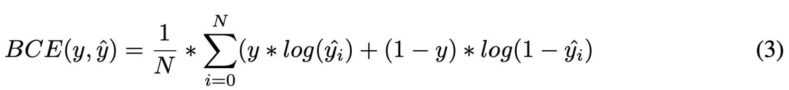
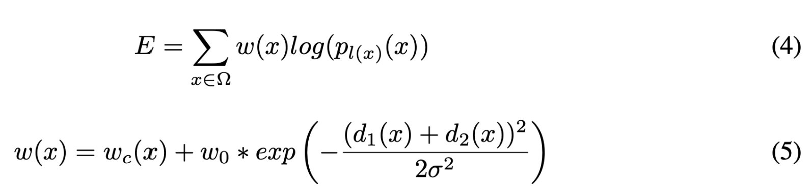
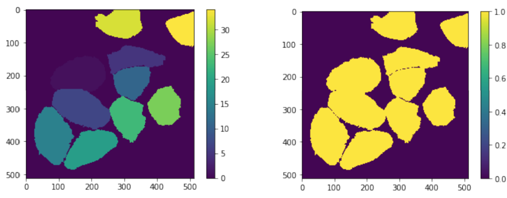
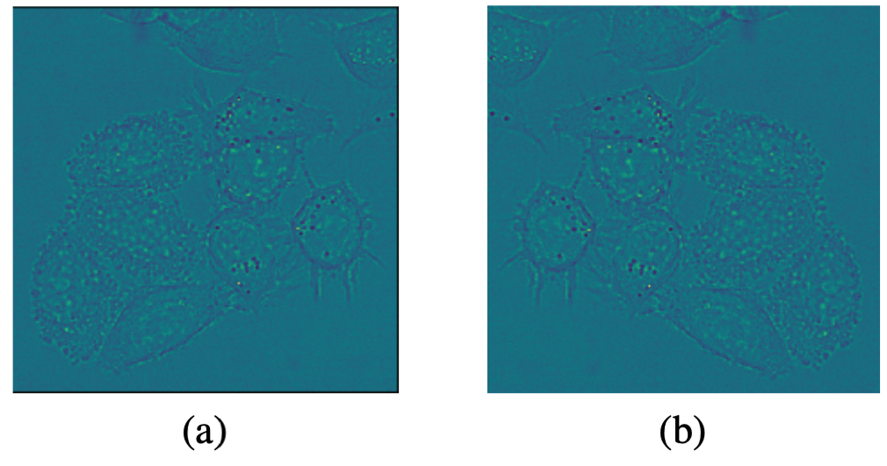
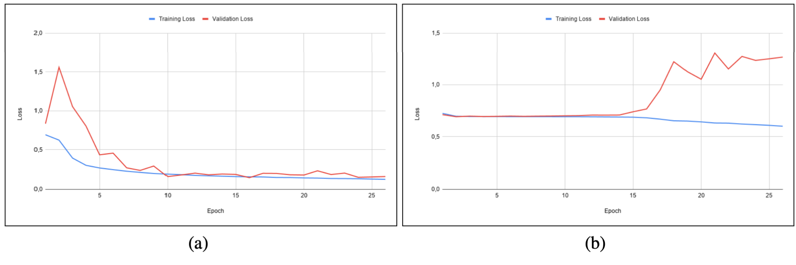
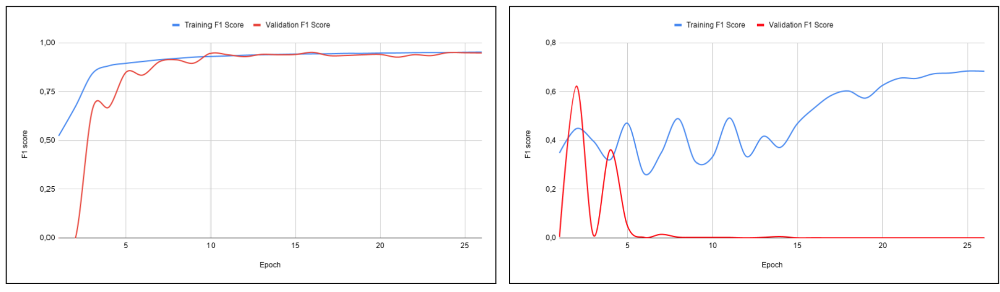
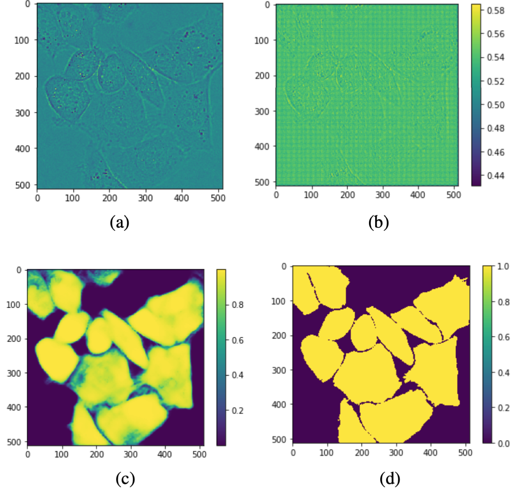
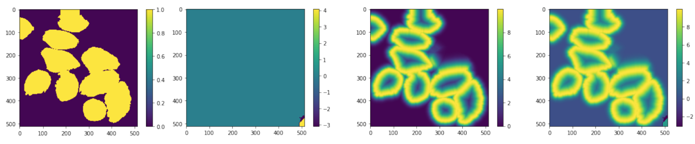

### Recreation, U-net: Convolutional networks for biomedical image segmentation

by Jacob Stachowicz, Max Joel Söderberg and Anton Ivarsson

Figure 1: Example U-net structure

Figure 2: Sample from the HeLa data set.

##### **Abstract:**

The subject of the project was biomedical image segmentation. Namely to reproduce the results of the paper "U-net: Convolutional networks for biomedical image
segmentation" by Olaf Ronnenberger, Philipp Fischer and Thomas Brox. After
the reproduction the goal was to implement another model for segmentation and
compare how the strategies used by Ronneberger et al. (2015) performed on the
other model. Due to time constraints the other model was not implemented. An
experiment was conducted in order to validate the data augmentation strategy used
by Ronneberger et al. (2015). A conclution could be made that the strategy was
sound. Without the strategy, our implemented U-net reached an IoU score of 0.332
and a F1 score of 0.605. With the strategy, our implemented U-net reached an
IoU score of 0.770 and a F1 score of 0.891. An algorithm was implemented to
perform another experiment for the custom loss function used by Ronneberger
et al. (2015). The experiment was not completed due to the chosen deep learning
framework being opinionated. However, studying the computed weights indicate
that the weights could help the model learn better borders between cells.

#### 1. Introduction

In this project we will work with biomedical image segmentation for cell images. Segmentation of
biomedical images is useful for a different number of purposes. For instance, Punitha et al. (2018)
used a Feed Forward Neural Network to segment images of benign and malignant breast cancer
(Punitha et al. 2018). This project aims to reproduce the results of the paper "U-net: Convolutional
networks for biomedical image segmentation" by Olaf Ronneberger, Philipp Fischer and Thomas
Brox. The authors of this paper mentions how there is a large consent that successful training of
deep learning networks requires many thousands of annotated training samples. However, in this
paper the authors present a strategy that relies heavily on data augmentation instead of a large sample
size, using an network architecture called "U-net". The purpose of the data augmentation approach
is to utilize the available annotated training samples more efficiently (Ronneberger et al. 2015). To
reproduce the results we will first implement the network. After the implementation of the network
we will validate that the strategies of Ronneberger et al. (2015), besides from the architecture gave
the improvements claimed. In addition to reproducing the results, this project will be conducted
with the intention to compare the segmentation network with another method of segmenting images.
That is, try training another network architecture for image segmentation with the same surrounding
strategies as Ronneberger et al. (2015).
Our initial assessment of the workload required to reproduce the results achieved by Ronneberger
et al. (2015) where incorrect. This flawed assessment led to us not having enough time left to compare
the results to a network with another architecture. Due to the chosen deep learning framework being
opinionated, we had trouble adding the custom loss function which Ronneberger et al. (2015) used
for instance segmentation. The custom loss function used precomputed weights for each training
sample. Even though we could not experiment with this custom loss function, we did implement an
algorithm for calculating the weights. Studying the computed weights indicate that the weights could
help the model learn better borders between cells that are stuck together. The lack of precomputed
border weights in this project forced us to focus on semantic segmentation, while Ronneberger et al.
(2015) focused on instance segmentation.
We could conclude that the strategy used for data augmentation by Ronneberger et al. (2015) was
sound. Training our U-net without the data augmentation the network achieved a IoU score of 0.332
and a F1 score of 0.605. With the data augmentation strategy we achieved a IoU score of 0.770 and a
F1 score of 0.891. These scores show that segmentation of cell images can be achieved accurately
without large amounts of data using this data augmentation strategy. All scores were calculated on
test data where the model with the lowest validation loss were used

#### 2 Related work

As mentioned in the introduction, this project was partly an attempt to reproduce the results by
Ronneberger et al. (2015). Because of this, the main source of reference was the aforementioned
paper. Ronneberger et al. (2015). implemented a convolutional neural network with the architecture
as seen in figure 1.
The authors implemented data augmentation that was mostly based on elastic deformations, as
well as Gaussian noise. The authors achieved well defined borders. These well defined borders
can seemingly be accredited towards the custom loss function implemented. This custom loss
function was a weighted pixel wise binary cross entropy that took advantage of precomputed weights
for each pixel in the data set. The initial weights of the network was drawn from a Gaussian
distribution with standard deviation p
2/N where N denotes the number of incoming nodes of one
neuron(Ronneberger et al. 2015). The authors network was implemented using Caffe with MATLAB,
as well as some parts in C++.

#### 3 Data

The data used in this project was the DIC-C2DH-HeLa data set (Cell Tracking Challenge, 2D+Time
Datasets n.d.). This data set consisted of 168 different transmission electron microscopy images
of HeLa cells on a flat glass as seen in figure 2. The images have the resolution of 512x512 pixels.
From the 168 images in the data set, 20 percent was used as test data and the rest was used in training
and validation. We created augmentations of both all the data intended for training and validation.
From each image 12 augmented versions where created, which lead to a 13 times larger training and
validation set.

#### 4 Methods
This section explains how the network was built, trained and how the data was preprocessed.

##### 4.1 Structure of the network
In this project, the convolutional network presented in Ronneberger et al. (2015) was implemented
using the Keras framework consisting of 23 convolutional layers, each with a ReLu activation function.
Due to memory constraints in the GPU, the batch size was set to 1 to be able to use large images. The
model used a Nesterov SGD optimizer with a momentum of 0.99, which allows previously seen data
to heavily influence the update in the optimization step.
In Ronneberger et al. (2015), the measurement of accuracy was done using IOU (1) which compares the intersection of the cells in relation to the union. In addition to that method, we also used F1 score
(2) to measure the accuracy in relation to precision and recall.

In image segmentation, it is possible using binary cross entropy (3) since it’s a pixel-wise classification
task

Training a large neural network on a small amount of data introduces the risk of overfitting the
network. To prevent this, a dropout was added at each layer with values ranging between 0.1 and 0.3.

##### 4.2 Custom loss function
The loss function was defined as can be seen in equation 4. Equation 5 shows the formula for how the
weight matrix was calculated. Ω is the set of pixels in a given image, wc(X) a precomputed weight
map to counteract class imbalance, d1(X) and d2(X) is the distance from the pixel X to the closest
and second closest cell respectively. l is the true label of each pixel.

##### 4.3 Preprocessing of data
Initially the label data consisted of matrices filled with the ground truth of where each cell was
located and which class label they had, (Figure 3a). Before training, these matrices were processed so
that each cell was represented as ones and the background as zero, (Figure 3b). This was necessary
since there was no logic in which class label each cell had and it also enabled the use of binary cross
entropy as a loss function.

Figure 3: (a) Unprocessed label (b) Color processed label.

One important key feature in the u-net paper was the augmentation of the training and validation
images and their corresponding labels. The main advantage this offers is the increase of training data.
The augmentation techniques used on the images in our project were rotation, zooming, changing
width or height and horizontal flip, (Figure 4). Our augmentations allowed us to increase our training data by a 12-fold, from 134 to 1447 training images, before being limited by the 16 GB’s of memory
in our training environment.

Figure 4: (a) A sample picture from the HeLa data set without augmentation (b) Augmentation of the
first image with a rotation of the y-axis

##### 4.4 Training

The training of the model was conducted with a limit of 100 epochs. An early stopping strategy was
used where the training would stop if the validation loss did not improve for 5 epochs consequently.
If an early stopping occurred the best weights according the validation loss was restored. The time
required for training was substantial which limited the amount of runs. The training with data
augmentation took an entire night to run on a system with 16 GB of RAM-memory and a Nvidia
GTX 1070 graphics card with 8 GB of dedicated memory.

##### 4.5 Experiment strategy

To to validate the data augmentation strategy by Ronneberger et al. (2015) our model was trained
with and without said strategy. Performance was then measured for each of these cases. The strategy
was planned for the custom loss function and the other model. However, due to time constraints the
other model was not implemented and subsequently not tested. The weights that were supposed to be
used in the custom loss function was studied, but not tested in actual training.

#### 5 Experiments
In this section the results of our experiments are presented.

##### 5.1 Effects of data augmentation

Figure 5 shows graphs over the change of loss through different epochs for the model with and
without augmented images. Figure 6 shows graphs over the change of F1-score through different
epochs for the model with and without data augmentation.

Figure 5: Binary cross entropy loss for each epoch through the training of the model (a) with
augmentation and (b) without augmentation.

Figure 6: F1-score for each epoch through the training of the model (a) with augmentation and (b)
without augmentation.

As shown in figure 6b, for the model without augmented data we see that the training score increases
with some instability while the validation score drops and stays around zero after 5 epochs. This
behavior indicates that overfitting occurs, which is common when there are too few data samples in
the training data set(Russell & Norvig 2010). This results in the model not being able to generalize
well on the unseen images in the validation data set. Increasing the training data using augmentation
reduces the phenomena of overfitting, which is visible in figure 6a. We see in figure 7c that the model
with the added augmented images in the training makes confident predictions that are near the ground
truth (figure 7d) while the predictions by the model without augmentations (figure 7b) are indecisive
and unclear.

Figure 7: (a) Sample form the test data set (b) The prediction made by the model without augmented
training images. (c) The prediction made by the model with augmented training data. (d) Shows the
ground truth for the sample picture. The bar to the right of the images shows the probability scale.

##### 5.2 Custom loss function and precomputed weights

The energy function is computed by a pixel-wise soft-max over the final feature map combined with
the cross entropy loss function. Figure 8c indicates how the energy function penalizes the deviation
of each pixel from the ground truth. As mentioned in section 4.3 the weights used in the custom loss
function consists of two parts. The first part is the class imbalance, which is refereed to as wc (figure
8b). The second part takes into account the distance for each pixel to the cell borders (figure 8c). The
combined weights as seen in figure 8d indicate the use of the custom loss function could improve the
prediction around the cell borders.

Figure 8: (a) Mask image, (b) Class imbalance mask, (c) Border mask (d) Image weights

#### 6 Conclusion
This project shows that an increase of accuracy for a u-net model with a small training set can be
achieved by increasing the amount of training data with augmentations. Even though the experiment
with the custom loss function could not be completed as intended, studying the computed weights
indicate that the weights could enhance the model’s prediction performance around and between cells.
These two experiments partially confirms the findings made in the original paper by Ronneberger
et al. (2015). Our implementation can be found at: https://gits-15.sys.kth.se/aivarss/DD2424Project.

#### References
- Cell Tracking Challenge, 2D+Time Datasets (n.d.), http://celltrackingchallenge.net/ 2d-datasets/. Accessed: 2020-05-01. 

- Punitha, S., Amuthan, A. & Joseph, K. S. (2018), ‘Benign and malignant breast cancer segmentation using optimized region growing technique’, Future Computing and Informatics Journal 3(2), 348–358.
- Ronneberger, O., Fischer, P. & Brox, T. (2015), U-net: Convolutional networks for biomedical image segmentation, in ‘International Conference on Medical image computing and computer-assisted intervention’, Springer, pp. 234–241.
- Russell, S. & Norvig, P. (2010), Artificial Intelligence: A Modern Approach, 3 edn, Prentice Hall.

